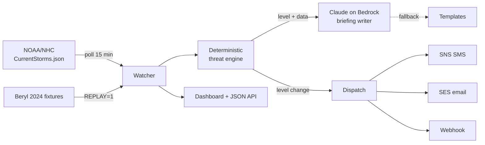

# Hurricane-Ready 🇧🇧

Hurricane preparedness alerts for Barbados (or any Caribbean island), in one hardened Docker container. Watches the National Hurricane Center feed, computes the threat deterministically, has Claude explain it calmly, and alerts by SMS, email, and webhook the moment the level changes.

> **Unofficial project.** Threat levels are computed automatically and may be wrong. Always follow official guidance from Barbados Meteorological Services and the Department of Emergency Management.

**Stack:** Node 22 · NOAA/NHC public feed · Claude on Amazon Bedrock · SNS (SMS) · SES (email) · Leaflet · Docker

## The design rule

**Deterministic code decides the threat level. AI only explains it.**

The threat engine (`src/threat.mjs`) is pure geometry: haversine distance, dead-reckoned track projection, and explicit thresholds — unit-tested, no I/O, no model in the loop. Claude receives the *decided* level and writes the calm, level-appropriate briefing; the prompt forbids it from changing the level. When lives are involved, a language model shouldn't be deciding how worried people ought to be.

## Threat levels

| Level | Trigger (defaults) |
| --- | --- |
| 🟢 ALL CLEAR | No active systems threatening the island |
| 🟡 WATCH | Active system in the Atlantic basin awareness box |
| 🟠 WARNING | Forecast track within 300 km inside 72 h |
| 🔴 IMMINENT | Within 150 km now, or forecast within 150 km inside 48 h |

Alerts dispatch **only on level changes** — no advisory spam.

## Quick demo (no AWS needed)

Replays Hurricane Beryl's 2024 approach to Barbados at accelerated speed — watch the dashboard climb ALL CLEAR → WATCH → WARNING → IMMINENT and back:

```bash
REPLAY=1 DISABLE_AI=1 docker compose up --build
# open http://localhost:8080
```

## Live mode

```bash
docker compose up --build
```

With AWS credentials mounted (`~/.aws`, read-only) you get Claude-written briefings via Bedrock. Configure channels through environment variables (see `compose.yaml`):

- `ALERT_EMAILS` + `SENDER_EMAIL` — SES email (sender must be SES-verified)
- `ALERT_PHONES` — SMS via SNS, E.164 format (`+1246...`)
- `WEBHOOK_URL` — Slack/Discord-compatible JSON POST

No credentials at all? It still works: live NHC polling, deterministic levels, template briefings, webhook alerts.

## Architecture



Container hardening: non-root, read-only filesystem, `cap_drop: ALL`, `no-new-privileges`, tmpfs for scratch, healthcheck, state on a named volume.

## Tests

```bash
npm test
```

The threat engine is fully covered: distances, track projection, every level boundary, multi-storm worst-case selection, and missing-data fallbacks.

## Limitations & roadmap

- Track projection is dead reckoning from current motion, not the official NHC forecast cone — good for a personal alerting layer, not a replacement for official products. Parsing the NHC GIS cone is the headline roadmap item.
- Wind-field size is ignored (distance is to the center); large storms matter farther out.
- Roadmap: official cone ingestion, parish-level shelter directory, multi-island fan-out, Bajan dialect briefing option.

## License

MIT — built by [Christopher Corbin](https://christophercorbin.cloud)
