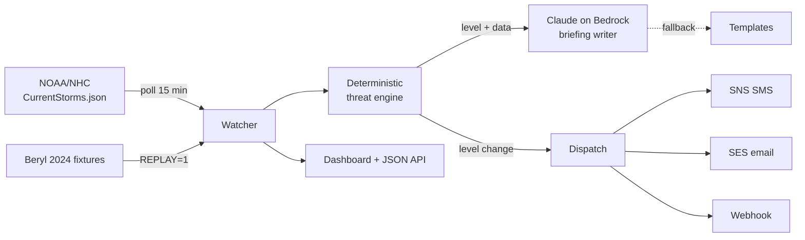

# Hurricane-Ready 🇧🇧

An easy-to-read Barbados weather dashboard **and** a hurricane preparedness alerter, in one hardened Docker container. It gives locals the everyday forecast in plain language, watches the National Hurricane Center feed, computes the storm threat deterministically, has Claude explain it calmly, and alerts by SMS, email, and webhook the moment the level changes.

> **Unofficial project.** Forecasts and threat levels are generated automatically and may be wrong. Always follow official guidance from Barbados Meteorological Services and the Department of Emergency Management.

**Stack:** Node 22 · NOAA/NHC public feeds · Open-Meteo (forecast + marine) · RainViewer radar · NOAA GOES satellite · Claude on Amazon Bedrock · SNS (SMS) · SES (email) · Leaflet · Docker

## Dashboard

A single scrolling page (sticky section nav) built for a general audience, with everything in plain language:

- **Right now** — current conditions plus a one-line "today at a glance" summary.
- **7-day** — daily forecast cards (icon, high/low, rain chance).
- **Rain & wind** — next-24h outlook in words, with an hourly strip.
- **Beach & sea** — sea state, wave height, UV, and **sun & moon** (sunrise/sunset, day length, moon phase).
- **Radar** — live RainViewer rain radar on a Leaflet map (with a play/pause loop), plus a NOAA GOES-East satellite still.
- **Storms & tropics** — active-system threat table, the **NHC Atlantic Tropical Weather Outlook** (areas to watch + 7-day formation chances, parsed from the public TWO feed), this season's **storm-name list** (active/used/next highlighted), the threat-level legend, and level history.
- **Get ready** — a plain-language hurricane-prep checklist (before the season / watch / warning) and an **official-sources hub** linking straight to Barbados Met Services products, DEM, and NHC.

Everyday weather comes from the free [Open-Meteo](https://open-meteo.com) forecast and marine APIs (no key). Tropical data comes from NOAA/NHC public products. Each section degrades gracefully — if a source is unavailable, that panel simply hides.

## The design rule

**Deterministic code decides the threat level. AI only explains it.**

The threat engine (`src/threat.mjs`) is pure geometry: haversine distance, dead-reckoned track projection, and explicit thresholds — unit-tested, no I/O, no model in the loop. Claude receives the *decided* level and writes the calm, level-appropriate briefing; the prompt forbids it from changing the level. When lives are involved, a language model shouldn't be deciding how worried people ought to be.

## Threat levels

| Level | Trigger (defaults) |
| --- | --- |
| 🟢 ALL CLEAR | No active systems threatening the island |
| 🟡 WATCH | Active system in the Atlantic basin awareness box |
| 🟠 WARNING | Forecast track within 300 km inside 72 h |
| 🔴 IMMINENT | Within 150 km now, or forecast within 150 km inside 48 h |

Alerts dispatch **only on level changes** — no advisory spam.

## Quick demo (no AWS needed)

Replays Hurricane Beryl's 2024 approach to Barbados at accelerated speed — watch the dashboard climb ALL CLEAR → WATCH → WARNING → IMMINENT and back:

```bash
REPLAY=1 DISABLE_AI=1 docker compose up --build
# open http://localhost:8080
```

## Live mode

```bash
docker compose up --build
```

With AWS credentials mounted (`~/.aws`, read-only) you get Claude-written briefings via Bedrock. Configure channels through environment variables (see `compose.yaml`):

- `ALERT_EMAILS` + `SENDER_EMAIL` — SES email (sender must be SES-verified)
- `ALERT_PHONES` — SMS via SNS, E.164 format (`+1246...`)
- `WEBHOOK_URL` — Slack/Discord-compatible JSON POST

No credentials at all? It still works: live NHC polling, deterministic levels, template briefings, webhook alerts.

## Architecture



Container hardening: non-root, read-only filesystem, `cap_drop: ALL`, `no-new-privileges`, tmpfs for scratch, healthcheck, state on a named volume.

## Tests

```bash
npm test
```

The threat engine is fully covered: distances, track projection, every level boundary, multi-storm worst-case selection, and missing-data fallbacks.

## CI/CD

Two workflows in `.github/workflows/`:

- **CI** (every PR and push): unit tests, then the real thing — builds the image, boots it in replay mode, and asserts the threat ladder actually climbs to IMMINENT and returns to ALL CLEAR via the API, plus a Trivy scan that fails the build on HIGH/CRITICAL vulnerabilities.
- **Release** (push to main): always publishes the image to GHCR (`ghcr.io/christophercorbin/hurricane-ready`). When the AWS repo variables are set, it additionally assumes a role via OIDC (no stored keys), pushes to ECR, and force-redeploys the ECS service.

To wire an AWS account: `cd infra && tofu apply` there, then set the outputs as GitHub repo variables (`AWS_DEPLOY_ROLE_ARN`, `ECR_REPOSITORY`, and later `ECS_CLUSTER`/`ECS_SERVICE`). Until then the pipeline is fully functional against GHCR — anyone can `docker run ghcr.io/christophercorbin/hurricane-ready`.

## How the threat is computed

For each active Atlantic storm, the watcher also fetches the official NHC **Forecast/Advisory (TCM)** and parses it deterministically (`src/advisory.mjs`): forecast positions at +12 through +120 hours, max winds, and 34-kt wind radii. Closest approach is computed along the **official forecast track** (interpolated hourly), falling back to dead reckoning from current motion only when no advisory is available — the dashboard labels which method was used. The 34-kt wind-field radius is subtracted from distances, because a storm reaches you when its winds do, not its center. Claude's briefings also receive the raw advisory excerpt for accurate detail (rainfall, timing), with the level still locked by the engine.

## Limitations & roadmap

- Uses official forecast track points, not the full probabilistic cone — approach distances carry the same uncertainty any single-track product does.
- Roadmap: cone-of-uncertainty rendering, parish-level shelter directory, multi-island fan-out, Bajan dialect briefing option, subscription endpoint with opt-in.

## License

MIT — built by [Christopher Corbin](https://christophercorbin.cloud)
