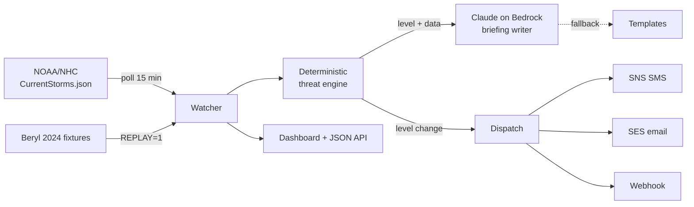

# Hurricane-Ready 🇧🇧

An easy-to-read Barbados weather dashboard **and** a hurricane preparedness alerter, in one hardened Docker container. It gives locals the everyday forecast in plain language, watches the National Hurricane Center feed, computes the storm threat deterministically, has Claude explain it calmly, and alerts by SMS, email, and webhook the moment the level changes.

> **Unofficial project.** Forecasts and threat levels are generated automatically and may be wrong. Always follow official guidance from Barbados Meteorological Services and the Department of Emergency Management.

**Stack:** Node 22 · NOAA/NHC public feeds · Open-Meteo (forecast + marine) · RainViewer radar · NOAA GOES satellite · Claude on Amazon Bedrock · SNS (SMS) · SES (email) · Web Push · installable PWA · Leaflet · Docker

## Dashboard

A single scrolling page (sticky section nav) built for a general audience, with everything in plain language:

- **Right now** — current conditions plus a one-line "today at a glance" summary.
- **7-day** — daily forecast cards (icon, high/low, rain chance).
- **Rain & wind** — next-24h outlook in words, with an hourly strip, plus a **flash-flood watch** (24-hour rainfall total + peak hourly intensity → plain-language flood risk).
- **Beach & sea** — sea state, wave height, UV, **sun & moon** (sunrise/sunset, day length, moon phase), and **air & tide** (US AQI, Saharan-dust/haze level, tide state and next high/low).
- **Radar & satellite** — live RainViewer rain radar on a Leaflet map (play/pause loop), plus a NOAA GOES-East GeoColor satellite view cropped to the eastern Caribbean, marked with Barbados and with its own animated loop. Both have a plain-language "What am I looking at?" explainer for non-technical readers.
- **Storms & tropics** — active-system threat table, a **wind-arrival estimate** ("tropical-storm-force winds could reach us by ~Xpm" from the forecast track + 34-kt wind radii), the **NHC Atlantic Tropical Weather Outlook** (areas to watch + 7-day formation chances, parsed from the public TWO feed), a **tropical-wave note** (parsed from NHC's Tropical Weather Discussion — flags when a wave's axis is crossing the island, explaining the showers without crying "storm"), this season's **storm-name list** (active/used/next highlighted), the threat-level legend, and level history.
- **Shelters & emergency** — verified Barbados emergency numbers (one-tap `tel:` links) and a parish-filtered finder for the official **DEM Category 1 hurricane shelters** (with wheelchair-access flags), linking to the current DEM booklet.
- **Get ready** — a plain-language hurricane-prep checklist (before the season / watch / warning) and an **official-sources hub** linking straight to Barbados Met Services products, DEM, and NHC.

A **settings** menu (⚙) remembers your choice of units (°C/°F, km/h / knots / mph) and theme (auto / light / dark). Each panel shows how fresh its data is ("updated X ago") and states clearly when a source is unavailable rather than showing stale silence.

Everyday weather, marine, and air-quality data come from the free [Open-Meteo](https://open-meteo.com) APIs (no key). Tropical data comes from NOAA/NHC public products; the shelter list and emergency numbers come from Barbados DEM. Each section degrades gracefully — if a source is unavailable, that panel simply hides or says so.

## Alerts & offline (installable PWA)

The dashboard is a Progressive Web App: installable to a phone's home screen, and it **works offline** — a service worker caches the app shell and the last `/api/status`, so during a storm (when connectivity drops) it still shows the last guidance and the prep checklist.

A one-tap **"Get storm alerts"** opt-in subscribes the browser to **Web Push** — no phone number, no account. When the threat level changes, the server pushes a notification to every subscriber (even with the app closed). Each subscriber can set a **minimum level** (e.g. only Warning and above) and an **overnight-quiet** option that mutes Watch-level pings 10pm–7am — Warning and Imminent always come through. It's entirely optional: set a VAPID keypair to enable it, or leave it off and the button simply hides.

```bash
npx web-push generate-vapid-keys      # once; put the pair in .env
# VAPID_PUBLIC_KEY / VAPID_PRIVATE_KEY / VAPID_SUBJECT (see .env.example)
```

Subscriptions persist on the `/data` volume. Expired ones (HTTP 410/404) self-prune on the next send. To test real delivery end-to-end: subscribe in the browser, then run the Beryl replay (`REPLAY=1`) and watch the level climb — each change fires a push.

### Rotating the VAPID keypair

VAPID keys are long-lived secrets. Rotate if you suspect the private key has been exposed (committed to git history, leaked in a backup or screen-share, copied to an AI tool with retention) — or on a routine schedule (annually is fine).

Rotation is mildly disruptive: **every existing subscriber is invalidated** and must re-subscribe in the browser. Plan accordingly (don't rotate the morning a hurricane is bearing down).

```bash
# 1. Generate a new keypair.
npx web-push generate-vapid-keys

# 2. Update the deployment secret store (AWS Secrets Manager / SSM /
#    Doppler / 1Password — whatever the deploy injects into the container).
#    DO NOT just paste the new keypair into .env on disk: that file is for
#    local dev, and disk-resident long-lived secrets are exactly what you're
#    rotating away from.

# 3. Redeploy. Old subscribers will get 410 Gone on the next dispatch and
#    self-prune from subscriptions.json. The "Get storm alerts" button stays
#    available; users who want pushes back must click it again.

# 4. (Local dev only) Update .env with the new keypair if you use it for
#    local testing.
```

If the key was ever committed to git (verify with `git log --all --full-history -- .env`), rotating alone isn't enough — also purge the history (e.g. `git filter-repo`) and force-push. The old key remains in any clones / forks / GitHub's reflog until that's done.

## The design rule

**Deterministic code decides the threat level. AI only explains it.**

The threat engine (`src/threat.mjs`) is pure geometry: haversine distance, dead-reckoned track projection, and explicit thresholds — unit-tested, no I/O, no model in the loop. Claude receives the *decided* level and writes the calm, level-appropriate briefing; the prompt forbids it from changing the level. When lives are involved, a language model shouldn't be deciding how worried people ought to be.

## Threat levels

| Level | Trigger (defaults) |
| --- | --- |
| 🟢 ALL CLEAR | No active systems threatening the island |
| 🟡 WATCH | Active system in the Atlantic basin awareness box |
| 🟠 WARNING | Forecast track within 300 km inside 72 h |
| 🔴 IMMINENT | Within 150 km now, or forecast within 150 km inside 48 h |

Alerts dispatch **only on level changes** — no advisory spam.

## Quick demo (no AWS needed)

Replays Hurricane Beryl's 2024 approach to Barbados at accelerated speed — watch the dashboard climb ALL CLEAR → WATCH → WARNING → IMMINENT and back:

```bash
REPLAY=1 DISABLE_AI=1 docker compose up --build
# open http://localhost:8080
```

## Live mode

```bash
docker compose up --build
```

With AWS credentials mounted (`~/.aws`, read-only) you get Claude-written briefings via Bedrock. Configure channels through environment variables (see `compose.yaml`):

- `ALERT_EMAILS` + `SENDER_EMAIL` — SES email (sender must be SES-verified)
- `ALERT_PHONES` — SMS via SNS, E.164 format (`+1246...`)
- `WEBHOOK_URL` — Slack/Discord-compatible JSON POST

No credentials at all? It still works: live NHC polling, deterministic levels, template briefings, webhook alerts.

## Architecture



Container hardening: non-root, read-only filesystem, `cap_drop: ALL`, `no-new-privileges`, tmpfs for scratch, healthcheck, state on a named volume.

## Tests

```bash
npm test
```

The threat engine is fully covered: distances, track projection, every level boundary, multi-storm worst-case selection, and missing-data fallbacks.

## CI/CD

Two workflows in `.github/workflows/`:

- **CI** (every PR and push): unit tests, then the real thing — builds the image, boots it in replay mode, asserts the threat ladder actually climbs to IMMINENT and returns to ALL CLEAR via the API, and runs a **Playwright frontend smoke test** that loads the live dashboard and asserts every section (forecast, rain & wind, sea, air, storms, shelters, …) is populated with real data and the service worker registers — so a silent UI break is caught in CI, not by users. Plus a Trivy scan that fails the build on HIGH/CRITICAL vulnerabilities.

**Monitoring:** `/healthz` returns liveness plus `dataAgeSeconds` and a `stale` flag (true when the watcher is up but hasn't refreshed in 3+ poll cycles). Point an uptime monitor (UptimeRobot, Pingdom, or a CloudWatch Synthetics canary) at `/healthz` and alert on non-200 or `stale: true`.
- **Release** (push to main): always publishes the image to GHCR (`ghcr.io/christophercorbin/hurricane-ready`). When the AWS repo variables are set, it additionally assumes a role via OIDC (no stored keys), pushes to ECR, and force-redeploys the ECS service.

To wire an AWS account: `cd infra && tofu apply` there, then set the outputs as GitHub repo variables (`AWS_DEPLOY_ROLE_ARN`, `ECR_REPOSITORY`, and later `ECS_CLUSTER`/`ECS_SERVICE`). Until then the pipeline is fully functional against GHCR — anyone can `docker run ghcr.io/christophercorbin/hurricane-ready`.

## How the threat is computed

For each active Atlantic storm, the watcher also fetches the official NHC **Forecast/Advisory (TCM)** and parses it deterministically (`src/advisory.mjs`): forecast positions at +12 through +120 hours, max winds, and 34-kt wind radii. Closest approach is computed along the **official forecast track** (interpolated hourly), falling back to dead reckoning from current motion only when no advisory is available — the dashboard labels which method was used. The 34-kt wind-field radius is subtracted from distances, because a storm reaches you when its winds do, not its center. Claude's briefings also receive the raw advisory excerpt for accurate detail (rainfall, timing), with the level still locked by the engine.

## Limitations & roadmap

- The storm map's cone of uncertainty is an approximation (forecast track points offset by the published 2026 average error radii), not NHC's exact polygon; the threat level keys off the single forecast track, so it carries that product's uncertainty.
- **Official civil-protection alerts** come from the Government of Barbados / DEM **CAP.CAP** system (Optimit CAPEWS platform). The server polls its public active-alarm count (`checkActiveAlarms`) each cycle and, when one or more alerts are live, shows a prominent red banner above everything linking to CAP.CAP — it never re-publishes the alert text (CAP.CAP stays the source of truth) and hides on any fetch failure. There's no public CAP *text* feed to parse; if DEM exposes one, the banner can be upgraded to show severity/effective/expires inline.
- **Routine BMS weather advisories** — small-craft, heavy-rain/flood, dust — are a separate, lower tier (issued by Barbados Met Services, not escalated through DEM CAP). They don't drive the threat level; the site links to BMS's current advisories rather than re-publishing them.
- Roadmap: multi-island fan-out, Bajan-dialect briefing option, historical "storms near Barbados" archive, official BMS CAP-feed ingest when available.

## License

MIT — built by [Christopher Corbin](https://christophercorbin.cloud)
